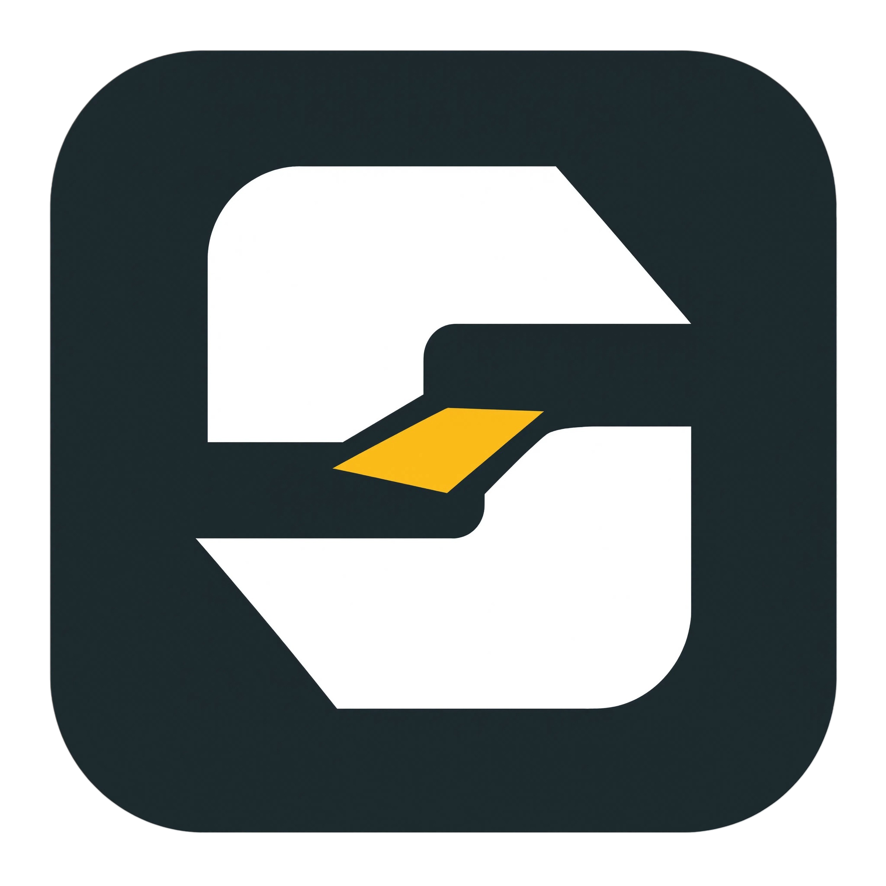

<p align="center">
  
</p>

<h1 align="center">Stow</h1>

<p align="center">
  <b>High-speed steganographic video concealer and extractor with zero size limits.</b><br/>
  Embed multi-gigabyte videos, movies, and archives into everyday images without breaking their viewability.
</p>

<p align="center">
  
  
  
  
</p>

---

## 🌟 Key Features

- **🖼️ 100% Image Viewability**: Output carrier files remain completely valid, normal images across all standard image viewers (Windows Photos, MS Paint, macOS Preview, iOS Photos, Android Gallery, Chrome/Safari).
- **⚡ Universal Zero-Limit Streaming**: Embed massive multi-gigabyte files (10 GB+, 50 GB+ 4K movies) with constant minimal memory usage (< 15 MB RAM) and up to 1.3+ GB/s throughput.
- **🔐 Military-Grade Encryption**: Optional password protection powered by **ChaCha20-Poly1305 AEAD** with **Argon2id** key derivation.
- **🛡️ Bit-Perfect Integrity**: Verifies BLAKE3 checksums during extraction for flawless byte-for-byte fidelity.
- **🎨 Built-in Theme Switcher**: 5 curated themes (Cyber Cyan, Midnight Violet, Emerald Matrix, Crimson Ruby, Monochrome Dark).
- **📱 Native Android App**: Jetpack Compose Android app with Scoped Storage support and password protection.
- **🧹 Image Cleaner**: One-click payload removal to restore pristine original cover images.

---

## 📦 Direct Downloads

Grab the latest standalone release for your platform from the [Releases Page](https://github.com/SubmitCodes/Stow/releases):

| Platform | Download File | Description |
| :--- | :--- | :--- |
| **🪟 Windows (64-bit)** | `Stow_Windows_x64.exe` | Standalone `.exe` with embedded icon (No installation needed). |
| **🍎 macOS (Universal)** | `Stow_macOS.dmg` | Standard Apple `.dmg` installer with drag-to-Applications (Apple Silicon + Intel). |
| **🐧 Linux (64-bit)** | `Stow_Linux_x86_64` | Standalone Linux desktop binary. |
| **📱 Android (APK)** | `Stow_Android.apk` | Native Android application with Stow launcher icon. |

---

## 📖 How to Use

### 1. 📦 Embed Video into Image (Conceal)
1. Open **Stow** and stay on the **Embed Video** tab.
2. Click **Browse Image...** to pick any cover picture (`.png`, `.jpg`, `.webp`, `.bmp`, `.gif`).
3. Click **Browse Video...** to select your video or media file (`.mp4`, `.mkv`, `.mov`, `.zip`, etc.).
4. *(Optional)* Check **Protect with a Password** and enter a password to encrypt your video with 256-bit ChaCha20-Poly1305.
5. Click **Embed Video into Image**. Your new carrier image is created and viewable in any photo viewer!

---

### 2. 🔓 Extract Video from Image (Restore)
1. Switch to the **Extract Video** tab.
2. Click **Browse Image...** and select the carrier image.
3. Stow automatically inspects the image in milliseconds and reveals the embedded video details.
4. *(If password-protected)* Enter the password.
5. Click **Extract Video from Image**. Your video will be extracted with full BLAKE3 checksum verification!

---

### 3. 🧹 Inspect & Clean Image (Remove Hidden Payload)
1. Switch to the **Inspect & Clean** tab.
2. Select any carrier image to view its internal geometry and size breakdown.
3. Click **Remove Embedded Video** to strip the hidden payload and restore the original pristine cover photo.

---

## 🛠️ Building from Source

### 1. Windows, macOS & Linux
Ensure you have [Rust](https://rustup.rs/) installed:
```bash
cargo build --release --workspace
```
The compiled binaries will be in `target/release/` (`stow-gui` / `secret_png_gui.exe`).

### 2. Linux One-Click Script
```bash
chmod +x build_linux.sh
./build_linux.sh
```

### 3. Android APK
Ensure you have JDK 17 and Android SDK:
```bash
cd android_app
./gradlew assembleDebug
```
The output APK will be in `android_app/app/build/outputs/apk/debug/app-debug.apk`.

---

## 📐 Binary Protocol Specification

```
+-------------------------------------------------------------------------------+
| 🖼️ HOST IMAGE COVER                                                           |
| (PNG / JPEG / WebP / GIF / BMP)                                               |
+-------------------------------------------------------------------------------+
| 🎬 PAYLOAD DATA STREAM                                                        |
| (Raw or ChaCha20-Poly1305 Encrypted Stream)                                   |
+-------------------------------------------------------------------------------+
| 📋 METADATA BLOCK (JSON serialized)                                           |
| - Original Filename & Extension (UTF-8)                                       |
| - MIME Type (e.g. video/mp4, video/x-matroska)                                |
| - Original & Payload Sizes: u64                                               |
| - BLAKE3 Checksum: 32 bytes (hex)                                             |
| - Encryption Salt & Nonce (if encrypted)                                      |
+-------------------------------------------------------------------------------+
| 📍 TRAILER INDEX (Fixed 64 bytes at exact EOF)                                |
| Magic b"SECRETPNG_V1\x00\x00\x00\x00" | Offset Pointers | CRC32 Checksums      |
+-------------------------------------------------------------------------------+
```

---

## 📄 License
This project is open-source under the [MIT License](LICENSE).
